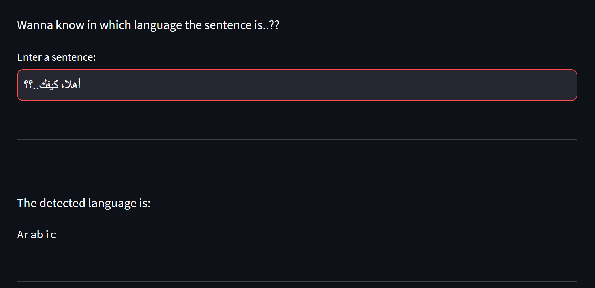

# Language-Detection-Model #
### This model is trained over a small dataset of different words and phrases of different languages. ###

### You can check out the step-by-step execution of the program in the Jupyter notebook file. ###

---

The webpage is just limited to training and testing the dataset and implementing it.

It's detailed analysis can be seen in the Jupyter Notebook file.

---

Basically, this ML model matches the words in a sentence entered by the user and then compares it with its stored words of different languages.

It then outputs the detected language according to the accuracy and precision of the model.

---

Try it yourself: [C'mon](https://language-detection-by-aryan.streamlit.app/)

---

Busy right now..?? Don't wanna visit some dark themed webpage..??

